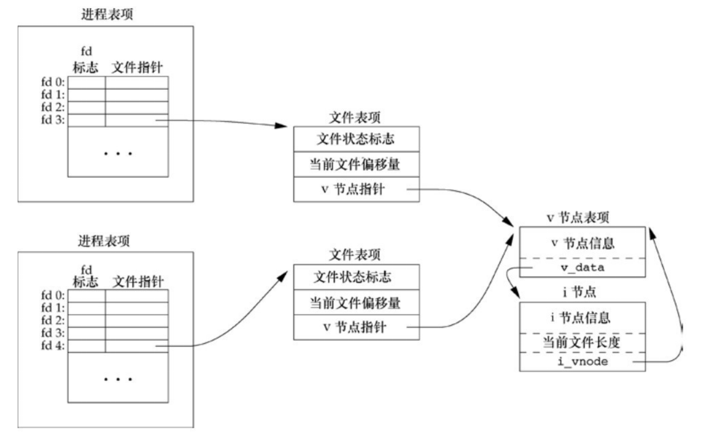
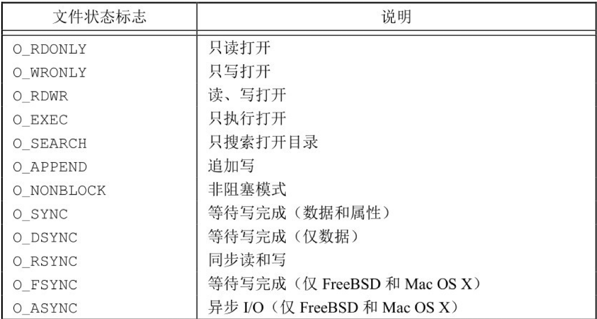

# 文件描述符

定义在<unistd.h>

0 STDIN_FILENO

1 STDOUT_FILENO

2 STDERR_FILENO

范围是 0--OPEN_MAX-1

##open(),openat()

```c
“#include <fcntl.h>
int open(const char *path, int oflag,... /* mode_t mode */);
int openat(int f d, const char *path, int oflag, ... /* mode_t mode */ );”
//成功则返回文件描述符,失败返回-1,
```

# creat()

```c
#include <fcntl.h>
int creat(const char *path, mode_t mode);
//返回值：若成功，返回为只写打开的文件描述符；若出错，返回−1
//注意，此函数等效于：
open(path, O_WRONLY｜O_CREAT｜O_TRUNC, mode);

```

在早期的 UNIX 系统版本中，open 的第二个参数只能是 0、1 或 2。无法打开一个尚未存在的文件，因此需要另一个系统调用 creat 以创建新文件。

现在，open 函数提供了选项 O_CREAT 和 O_TRUNC，于是也就不再需要单独的 creat 函数

```c
//要创建一个临时文件，并要先写该文件，然后又读该文件
open(path, O_RDWR｜O_CREAT｜O_TRUNC, mode);
```

# close()

```c
#include <unistd.h>

int close (int fd)；

//返回值：若成功，返回0；若出错，返回−1

//关闭一个文件时还会释放该进程加在该文件上的所有记录锁。
//进程终止时内核自动关闭他打开的所有文件
```

# lseek()

```c
//每个打开文件都有一个与其相关联的“当前文件偏移量”（current file offset）
//可以调用lseek显式地为一个打开文件设置偏移量。

#include <unistd.h>

off_t lseek(int fd, off_t offset, int whence);

//返回值：若成功，返回新的文件偏移量；若出错，返回为−1
```

对参数 offset 的解释与参数 whence 的值有关。

•若 whence 是 SEEK_SET 0 ，则将该文件的偏移量设置为距文件开始处 offset 个字节。

•若 whence 是 SEEK_CUR 1，则将该文件的偏移量设置为其当前值加 offset，offset 可为正或负。

•若 whence 是 SEEK_END 2，则将该文件的偏移量设置为文件长度加 offset，offset 可正可负。

```c
//若lseek成功执行，则返回新的文件偏移量，为此可以用下列方式确定打开文件的当前偏移量：

off_t currpos;

currpos = lseek(fd, 0, SEEK_CUR);
```

这种方法也可用来确定所涉及的文件是否可以设置偏移量。如果文件描述符指向的是一个管道、FIFO 或网络套接字，则 lseek 返回 −1，并将 errno 设置为 ESPIPE。

**因为偏移量可能是负值，所以在比较 lseek 的返回值时应当谨慎，不要测试它是否小于 0，而要测试它是否等于 −1**

# read()

调用 read 函数从打开文件中读数据。

```c
#include <unistd.h>

ssize_t read(int fd, void *buf, size_t nbytes);
```

返回值：读到的字节数，若已到文件尾，返回 0；若出错，返回 −1

如 read 成功，则返回读到的字节数。如已到达文件的尾端，则返回 0。

# write()

调用 write 函数向打开文件写数据。

```C
#include <unistd.h>

ssize_t write(int fd, const void *buf, size_t nbytes);
```

返回值：若成功，返回已写的字节数；若出错，返回 −1

# 文件共享

“内核使用 3 种数据结构表示打开文件”

“内核使用 3 种数据结构表示打开文件，它们之间的关系决定了在文件共享方面一个进程对另一个进程可能产生的影响。
（1）每个进程在进程表中都有一个记录项，记录项中包含一张打开文件描述符表，可将其视为一个矢量，每个描述符占用一项。与每个文件描述符相关联的是：
a．文件描述符标志（close_on_exec，参见图 3-7 和 3.14 节）；
b．指向一个文件表项的指针。
（2）内核为所有打开文件维持一张文件表。每个文件表项包含：
a．文件状态标志（读、写、添写、同步和非阻塞等，关于这些标志的更多信息参见 3.14 节）；
b．当前文件偏移量；
c．指向该文件 v 节点表项的指针。
（3）每个打开文件（或设备）都有一个 v 节点（v-node）结构。v 节点包含了文件类型和对此文件进行各种操作函数的指针。对于大多数文件，v 节点还包含了该文件的 i 节点（i-node，索引节点）。这些信息是在打开文件时从磁盘上读入内存的，所以，文件的所有相关信息都是随时可用的。例如，i 节点包含了文件的所有者、文件长度、指向文件实际数据块在磁盘上所在位置的指针等




# 原子操作

任何要求多于一个函数调用的操作都不是原子操作，因为在两个函数调用之间，内核有可能会临时挂起进程

打开文件时设置 O_APPEND 标志,这样做使得内核在每次写操作之前，都将进程的当前偏移量设置到该文件的尾端处，于是在每次写之前就不再需要调用 lseek

## pread 和 pwrite

```c
#include <unistd.h>

ssize_t pread(int fd, void *buf, size_t nbytes, off_t offset);

//返回值：读到的字节数，若已到文件尾，返回0；若出错，返回−1

ssize_t pwrite(int fd, const void *buf, size_t nbytes, off_t offset);

//返回值：若成功，返回已写的字节数；若出错，返回−1
```

调用 pread 相当于调用 lseek 后调用 read，但是 pread 又与这种顺序调用有下列重要区别。

•调用 pread 时，无法中断其定位和读操作。

•不更新当前文件偏移量。

调用 pwrite 相当于调用 lseek 后调用 write，但也与它们有类似的区别。

# 函数 dup 和 dup2

复制现有的文件描述符

```c
#include <unistd.h>

int dup(int fd);
//由dup返回的新文件描述符一定是当前可用文件描述符中的最小数值

int dup2(int fd, int fd2);
//用fd2参数指定新描述符的值。
//如果fd2已经打开，则先将其关闭。
//如若fd等于fd2，则dup2返回fd2，而不关闭它。
//否则，fd2的FD_CLOEXEC文件描述符标志就被清除，这样fd2在进程调用exec时是打开状态


//两函数的返回值：若成功，返回新的文件描述符；若出错，返回−1
```

这些函数返回的新文件描述符与参数 fd 共享同一个文件表项


# 函数 sync、fsync 和 fdatasync

为了保证磁盘上实际文件系统与缓冲区中内容的一致性，UNIX 系统提供了 sync、fsync 和 fdatasync 三个函数。

```c
#include<unistd.h>
int fsync(int fd);
int fdatasync(int fd);
//返回值：若成功，返回0；若出错，返回−1
void sync(void);
//sync只是将所有修改过的块缓冲区排入写队列，然后就返回，它并不等待实际写磁盘操作结束。
```

称为 update 的系统守护进程周期性地调用（一般每隔 30 秒）sync 函数。这就保证了定期冲洗（flush）内核的块缓冲区。命令 sync(1)也调用 sync 函数。

fsync 函数只对由文件描述符 fd 指定的一个文件起作用，并且等待写磁盘操作结束才返回。确保修改过的块立即写到磁盘上.

fdatasync 函数类似于 fsync，但它只影响文件的数据部分,fsync 还会同步文件的属性

# 函数 fcntl

file_control

```c
fcntl函数可以改变已经打开文件的属性。

#include<fcntl.h>

int fcntl(int fd, int cmd, ... /* int arg */);

//返回值：若成功，则依赖于cmd（见下）；若出错，返回−1
```

fcntl 函数有以下 5 种功能。
（1）复制一个已有的描述符（cmd=F_DUPFD 或 F_DUPFD_CLOEXEC）。
（2）获取/设置文件描述符标志（cmd=F_GETFD 或 F_SETFD）。
（3）获取/设置文件状态标志（cmd=F_GETFL 或 F_SETFL）。
（4）获取/设置异步 I/O 所有权（cmd=F_GETOWN 或 F_SETOWN）。
（5）获取/设置记录锁（cmd=F_GETLK、F_SETLK 或 F_SETLKW）。

F_DUPFD: 复制 fd,新描述符是大于等于 3 的未使用的最小值,并且与 fd 共享同一文件表项.清除文件描述符标志(FD_CLOEXEC),在 exec 时仍然保持有效

F_DUPFD_CLOEXEC 设置与新描述符关联的 FD_CLOEXEC 文件描述符标志的值，返回新文件描述符。

> close_on_exec:是一个进程所有文件描述符（文件句柄）的位图标志，每个比特位代表一个打开的文件描述符的标志位，用于确定在调用系统调用 execve()时是否需要关闭文件的句柄。
>
> 此标志设置为 0(系统默认，在 exec 时不关闭)或 1(在 exec 时关闭)
>
> fcntl(fd, F_SETFD, FD_CLOEXEC);
>
> //or
>
> fcntl(fd, F_SETFD, 0);

F_GETFD 返回文件描述符标志

F_SETFD 对于 fd 设置文件描述符标志。新标志值按第 3 个参数（取为整型值）设置. 将此标志(FD_CLOEXEC)设置为 0（系统默认，在 exec 时不关闭）或 1（在 exec 时关闭）

F_GETFL 对应于 fd 的文件状态标志作为函数值返回



F_SETFL 将文件状态标志设置为第 3 个参数的值（取为整型值）。可以更改的几个标志是：O_APPEND、O_NONBLOCK、O_SYNC、O_DSYNC、O_RSYNC、O_FSYNC 和 O_ASYNC

F_GETOWN 获取当前接收 SIGIO 和 SIGURG 信号的进程 ID 或进程组 ID。

F_SETOWN 设置接收 SIGIO 和 SIGURG 信号的进程 ID 或进程组 ID。正的 arg 指定一个进程 ID，负的 arg 表示等于 arg 绝对值的一个进程组 ID

> fcntl 返回值与命令相关,出错返回-1,成功则 F_DUPFD 返回新文件描述符,F_GETFD,F_GETFL 返回相应的标志,F_GETOWN 返回正的进程 ID 或者负的进程组 ID

```C
flags | = O_SYNC; // 打开标志位 IO立即刷新
flags &| = FLAGS; // turn FLAGS off
```

# 函数 ioctl

```c
#include <unistd.h>　　/* System V */

#include <sys/ioctl.h> /* BSD and Linux */

int ioctl(int fd, int request, ...);

//返回值：若出错，返回−1；若成功，返回其他值
```

## 习题 3.6

果使用追加标志打开一个文件以便读、写，能否仍用 lseek 在任一位置开始读？能否用 lseek 更新文件中任一部分的数据？请编写一段程序验证

答: 以 O_APPEND 方式打开文件, 会在每次写文件时设置文件偏移量为文件长度,

​ 尽管 lseek 会将文件表项中的偏移量更新,调用 read.会读取 lseek 设置的偏移量处. 但是每次写入还是会写在文件长度的偏移量处.(读在自定义的偏移量, 写在文件最后)
