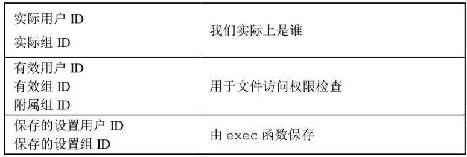
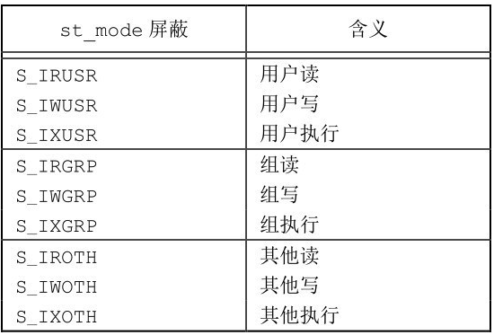
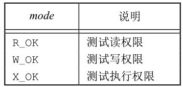
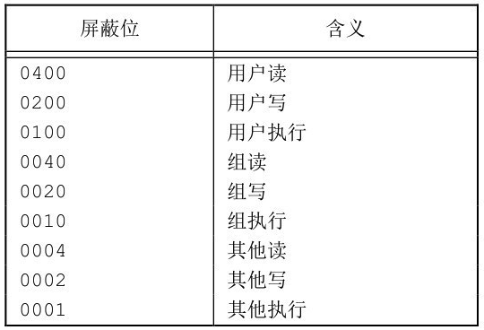
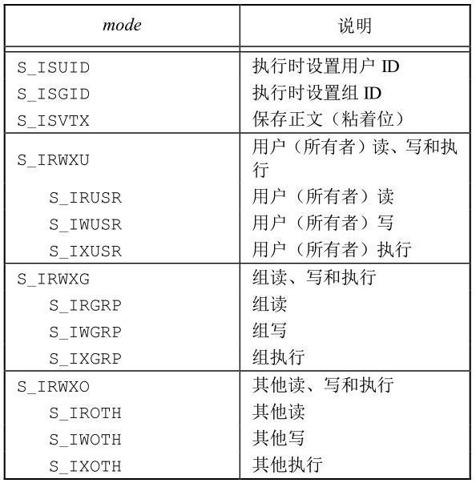

# 函数stat,fstat,fstatat,lstat

```c
#include <sys/stat.h>

int stat(const char *restrict pathname, struct stat *restrict buf);

int fstat(int fd, struct stat *buf);

int lstat(const char *restrict pathname, struct stat *restrict buf);

int fstatat(int fd, const char *restrict pathname, struct stat *restrict buf, int flag);
```

stat使用pathname打开.

fstat使用fd打开

lstat 当命名的文件是一个符号链接时，lstat返回该符号链接的有关信息，而不是由该符号链接引用的文件的信息

buf是一个结构体

```c
struct stat {

mode_t　　　　　　　 st_mode;　　 /* file type & mode (permissions) */
ino_t　　　　　　　　st_ino;　　　 /* i-node number (serial number) */
dev_t　　　　　　　　st_dev;　　　 /* device number (file system) */
dev_t　　　　　　　　st_rdev;　　 /* device number for special files */
nlink_t　　　　　　　st_nlink;　　/* number of links */
uid_t　　　　　　　　st_uid;　　　 /* user ID of owner */
gid_t　　　　　　　　st_gid;　　　 /* group ID of owner */
off_t　　　　　　　　st_size;　　 /* size in bytes, for regular files */
struct timespec　　 st_atime;　　/* time of last access */
struct timespec　　 st_mtime;　　/* time of last modification */
struct timespec　　 st_ctime;　　/* time of last file status change */
blksize_t　　　　　　st_blksize;　/* best I/O block size */
blkcnt_t　　　　　　 st_blocks;　 /* number of disk blocks allocated */
};
//timespec结构类型按照秒和纳秒定义了时间，至少包括下面两个字段：
time_t tv_sec;
long tv_nsec;
```

# 文件类型

- 普通文件（regular file） 对普通文件内容的解释由处理该文件的应用程序进行。
- 目录文件（directory file）。这种文件包含了其他文件的名字以及指向与这些文件有关信息的指针。对一个目录文件具有读权限的任一进程都可以读该目录的内容，但只有内核可以直接写目录文件。进程必须使用本章介绍的函数才能更改目录。
- 块特殊文件（block special file）。这种类型的文件提供对设备（如磁盘）带缓冲的访问，每次访问以固定长度为单位进行。 <!--注意，FreeBSD不再支持块特殊文件。对设备的所有访问需要通过字符特殊文件进行-->
- FIFO。这种类型的文件用于进程间通信，有时也称为命名管道（named pipe）
- 套接字（socket）。这种类型的文件用于进程间的网络通信。套接字也可用于在一台宿主机上进程之间的非网络通信。
- 符号链接（symbolic link）。这种类型的文件指向另一个文件。

使用宏来确定文件类型

```c
#define S_ISBLK(m)         /* block special */
#define S_ISCHR(m)         /* char special */
#define S_ISDIR(m)          /* directory */
#define S_ISFIFO(m)         /* fifo or socket */
#define S_ISREG(m)          /* regular file */
#define S_ISLNK(m)          /* symbolic link */
#define S_ISSOCK(m)        /* socket */
```

# 设置用户ID和设置组ID(SUID,SGID)



通常，有效用户ID等于实际用户ID，有效组ID等于实际组ID

每个文件有一个所有者和组所有者，所有者由stat结构中的st_uid指定，组所有者则由st_gid指定。

# 文件访问权限

st_mode值也包含了对文件的访问权限位



进程每次打开、创建或删除一个文件时，内核就进行文件访问权限测试

这种测试可能涉及文件的所有者（st_uid和st_gid）[文件性质]、

**进程的有效ID（有效用户ID和有效组ID）**以及进程的附属组ID（若支持的话）[进程性质]

测试具体如下:

1. 若进程的有效用户ID是0（超级用户），则允许访问。这给予了超级用户对整个文件系统进行处理的最充分的自由。
2. 若进程的有效用户ID等于文件的所有者ID（也就是进程拥有此文件），那么如果所有者适当的访问权限位被设置，则允许访问；否则拒绝访问。适当的访问权限位指的是，若进程为读而打开该文件，则用户读位应为1；若进程为写而打开该文件，则用户写位应为1；若进程将执行该文件，则用户执行位应为1。
3. 若进程的有效组ID或进程的附属组ID之一等于文件的组ID，那么如果组适当的访问权限位被设置，则允许访问；否则拒绝访问。
4. 若其他用户适当的访问权限位被设置，则允许访问；否则拒绝访问

# 新文件和目录的所有权

新文件的**用户ID**设置为**进程的有效用户ID**。

关于**组ID**，POSIX.1允许实现选择下列之一作为新文件的组ID。

（1）新文件的组ID可以是进程的有效组ID。

（2）新文件的组ID可以是它所在目录的组ID。

根据系统不同,

FreeBSD 8.0和Mac OS X 10.6.8总是使用目录的组ID作为新文件的组ID

对于 Linux 3.2.0 和Solaris 10，如果该目录的组ID位已经被设置，则新文件的组ID设置为目录的组ID；否则新文件的组ID设置为进程的有效组ID

# 函数access和faccessat

进程也希望按其**实际用户ID和实际组ID**来**测试其访问能力**。

access和faccessat函数是按实际用户ID和实际组ID进行访问权限测试的。（该测试也分成4步，这与4.5节中所述的一样，但将有效改为实际。）

```c
#include <unistd.h>

int access(const char *pathname, int mode);

int faccessat(int fd, const char *pathname, int mode, int flag);
//两个函数的返回值：若成功，返回0；若出错，返回-1
```

如果测试文件是否已经存在，mode就为F_OK；否则mode是图4-7中所列常量的按位或。



faccessat函数与access函数在下面两种情况下是相同的：一种是pathname参数为绝对路径，另一种是fd参数取值为AT_FDCWD而pathname参数为相对路径。否则，faccessat计算相对于打开目录（由fd参数指向）的pathname。

flag参数可以用于改变faccessat的行为，如果flag设置为AT_EACCESS，访问检查用的是调用进程的**有效用户ID和有效组ID**，而不是实际用户ID和实际组ID。

# 函数umask

umask 函数为进程设置文件模式创建屏蔽字，并返回之前的值。（这是少数几个没有出错返回函数中的一个。）

```c
#include <sys/stat.h>

mode_t umask(mode_t cmask);

返回值：之前的文件模式创建屏蔽字
```

其中，参数cmask是由图4-6中列出的9个常量（S_IRUSR、S_IWUSR等）中的若干个按位“或”构成的。


在进程创建一个新文件或新目录时，就一定会使用文件模式创建屏蔽字

在文件模式创建屏蔽字中为1的位，在文件mode中的相应位一定被关闭。

用户可以设置umask值以控制他们所创建文件的默认权限。该值表示成八进制数，一位代表一种要屏蔽的权限



# 函数chmod,fchmod,fchmodat

```c
#include <sys/stat.h>

int chmod(const char *pathname, mode_t mode);

int fchmod(int fd, mode_t mode);

int fchmodat(int fd, const char *pathname, mode_t mode, int flag);

//3个函数返回值：若成功，返回0；若出错，返回−1
```

chmod 函数在指定的文件上进行操作，而 fchmod 函数则对已打开的文件进行操作。

fchmodat函数与chmod函数在下面两种情况下是相同的：一种是pathname参数为绝对路径，另一种是fd参数取值为AT_FDCWD而pathname参数为相对路径。否则，fchmodat计算相对于打开目录（由fd参数指向）的pathname。

flag参数可以用于改变fchmodat的行为，当设置了AT_SYMLINK_NOFOLLOW标志时，fchmodat并不会跟随符号链接

为了改变一个文件的权限位，进程的有效用户ID必须等于文件的所有者ID，或者该进程必须具有超级用户权限



Mode == 按位或运算

# 粘着位

S_ISVTX位 也称为保存正文位（saved-text bit）

Single UNIX Specification允许针对目录设置粘着位。如果对一个目录设置了粘着位，只有对该目录具有写权限的用户并且满足下列条件之一，才能删除或重命名该目录下的文件：

•拥有此文件；

•拥有此目录；

•是超级用户。

常用于/tmp, /var/tmp

任一用户（用户、组和其他）对这两个目录的权限通常都是读、写和执行。但是用户不应能删除或重命名属于其他人的文件，为此在这两个目录的文件模式中都设置了粘着位。

# 函数chown,fchown,fchownat,lchown

用于更改文件的用户ID和组ID。如果两个参数owner或group中的任意一个是-1，则对应的ID不变。

```c
#include <unistd.h>

int chown(const char *pathname, uid_t owner, gid_t group);

int fchown(int fd, uid_t owner, gid_t group);
//fchown函数改变fd参数指向的打开文件的所有者
int fchownat(int fd, const char *pathname, uid_t owner, gid_t group, int flag);

int lchown(const char *pathname, uid_t owner, gid_t group);
//4个函数的返回值：若成功，返回0；若出错，返回-1
```

在符号链接情况下，lchown和fchownat（设置了AT_SYMLINK_NOFOLLOW标志）更改符号链接本身的所有者，而不是该符号链接所指向的文件的所有者。

- fchownat函数与chown或者lchown函数在下面两种情况下是相同的：
  - 一种是pathname参数为绝对路径，
  - 另一种是fd参数取值为AT_FDCWD而pathname参数为相对路径。

​	在这两种情况下，如果flag参数中设置了AT_SYMLINK_NOFOLLOW标志，fchownat与lchown行为相同，

- 如果flag参数中**清除了AT_SYMLINK_NOFOLLOW标志**，则fchownat与chown行为相同。
- 如果fd参数设置为打开目录的文件描述符，并且pathname参数是一个相对路径名，fchownat函数计算相对于打开目录的pathname。

若_POSIX_CHOWN_RESTRICTED对指定的文件生效，则

（1）只有超级用户进程能更改该文件的用户ID；(普通用户不能更改其他用户文件的用户ID)

（2）如果进程拥有此文件（其有效用户ID等于该文件的用户ID），参数owner等于-1或文件的用户ID，并且参数group等于进程的有效组ID或进程的附属组ID之一，那么一个非超级用户进程可以更改该文件的组ID。(你可以更改你所拥用的文件的组ID，但只能改到你所属的组。)

